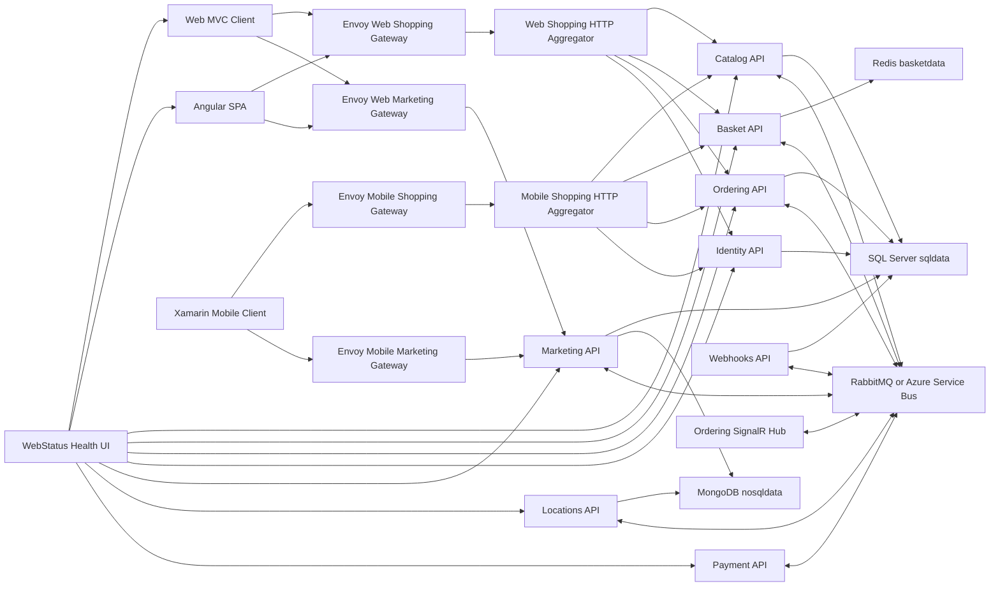

# eShopOnContainers Architecture

eShopOnContainers is a .NET Core reference application that demonstrates a containerized, microservice-oriented ecommerce system. It is intentionally larger than a minimal sample: the repo shows several architectural styles side by side, including simple CRUD services, domain-driven services, CQRS-style command/query separation, asynchronous integration events, API gateways, BFF aggregators, web clients, mobile clients, Docker Compose, Kubernetes/Helm deployment, health checks, and CI/CD assets.

The application models a simplified online store. Customers browse catalog items and marketing campaigns, manage a basket, sign in through the identity service, check out, create orders, receive order status updates, and can register webhooks for selected events.

## Repository Layout

- `src/Services` contains the backend microservices.
- `src/ApiGateways` contains Envoy gateway configuration and .NET HTTP aggregator/BFF services.
- `src/Web` contains the MVC web app, Angular SPA, webhooks demo client, and health status UI.
- `src/Mobile` contains the Xamarin mobile application and related mobile client code.
- `src/BuildingBlocks` contains reusable infrastructure used by multiple services, such as event bus abstractions, RabbitMQ/Azure Service Bus implementations, integration event logging, health checks, and web host customization.
- `src/Tests` and service-specific `*.UnitTests`/`*.FunctionalTests` projects contain automated tests.
- `deploy/k8s` contains Kubernetes manifests and Helm charts.
- `deploy/azure`, `deploy/elk`, and `deploy/windows` contain environment-specific deployment and operations assets.
- `build` contains Azure DevOps pipeline definitions and image build scripts.

## High-Level Topology



## Runtime Infrastructure

The default local runtime is Docker Compose under `src/docker-compose.yml` and `src/docker-compose.override.yml`.

Core infrastructure containers:

- `sqldata`: Microsoft SQL Server 2017, used by services that persist relational data.
- `nosqldata`: MongoDB, used by services that keep document-style data.
- `basketdata`: Redis, used by the basket service for fast per-user basket storage.
- `rabbitmq`: RabbitMQ with the management UI, used as the default event bus broker.
- `seq`: Seq log server, used for centralized structured log viewing.

The code can switch the event bus to Azure Service Bus through configuration (`AzureServiceBusEnabled` and related connection settings). Several services also include Azure-oriented settings for Application Insights, Azure Storage, Azure SQL, Cosmos DB, and AKS/Helm deployment.

## Backend Services

### Identity API

Project: `src/Services/Identity/Identity.API`

The identity service is the authentication and authorization authority. It stores identity data in SQL Server through Entity Framework Core and exposes OAuth/OpenID Connect-style endpoints for the web, SPA, mobile, API gateway, and service clients. Other services validate tokens issued by this service.

It configures client URLs for MVC, SPA, Xamarin, basket, ordering, catalog/marketing/location clients, webhooks, and aggregators. In local Compose, it is exposed on port `5105`.

### Catalog API

Project: `src/Services/Catalog/Catalog.API`

The catalog service owns product catalog data: catalog items, brands, types, prices, available stock, and product pictures. It uses SQL Server and EF Core migrations. It exposes HTTP APIs for catalog browsing and image retrieval, and it also exposes gRPC endpoints used by the shopping aggregators for efficient internal calls.

Catalog publishes and consumes integration events. For example, product price changes are published so baskets and webhooks can react. Catalog also reacts to order status events to validate stock and publish stock-confirmed or stock-rejected events.

### Basket API

Project: `src/Services/Basket/Basket.API`

The basket service owns each customer's active shopping basket. It stores basket data in Redis and exposes HTTP and gRPC APIs for reading, updating, and deleting baskets.

During checkout it publishes a `UserCheckoutAcceptedIntegrationEvent`. It also listens for product price changes so basket item prices can stay aligned with the catalog, and listens for order-started events so checked-out baskets can be cleaned up.

### Ordering API

Projects:

- `src/Services/Ordering/Ordering.API`
- `src/Services/Ordering/Ordering.Domain`
- `src/Services/Ordering/Ordering.Infrastructure`

Ordering is the richest domain service in the solution. It uses a Domain-Driven Design structure with aggregates, value objects, repositories, domain events, and a unit-of-work style persistence boundary.

Key concepts:

- `Ordering.Domain` contains the order and buyer aggregates, domain events, seedwork, and domain exceptions.
- `Ordering.Infrastructure` contains EF Core persistence, entity configurations, repositories, and idempotency support.
- `Ordering.API` contains controllers, application commands, queries, validation, integration event handlers, and gRPC endpoints.

Ordering owns order lifecycle state. It consumes checkout, stock, grace-period, and payment integration events, transitions order state, and publishes status-change events such as submitted, awaiting validation, stock confirmed, paid, shipped, and cancelled.

### Ordering BackgroundTasks

Project: `src/Services/Ordering/Ordering.BackgroundTasks`

This background worker supports delayed order processing. It periodically checks for orders in the configured grace period and publishes a `GracePeriodConfirmedIntegrationEvent` when the order should continue to validation. This keeps delayed workflow behavior outside the main API process while still participating in the same event-driven flow.

### Ordering SignalR Hub

Project: `src/Services/Ordering/Ordering.SignalrHub`

The SignalR hub provides real-time order status notifications to clients. It subscribes to ordering integration events through the event bus and pushes updates to connected web clients. In local Compose it is exposed on port `5112`, while clients reference it through gateway-facing URLs.

### Payment API

Project: `src/Services/Payment/Payment.API`

The payment service is a simplified payment processor. It listens for `OrderStatusChangedToStockConfirmedIntegrationEvent`, simulates a payment decision, and publishes either `OrderPaymentSucceededIntegrationEvent` or `OrderPaymentFailedIntegrationEvent`. Ordering consumes these events to continue or cancel the order workflow.

### Marketing API

Project: `src/Services/Marketing/Marketing.API`

The marketing service manages campaigns, campaign pictures, campaign rules, and location-aware marketing data. It uses SQL Server for campaign data and MongoDB for read/location-oriented data. It exposes HTTP APIs for campaign retrieval and location-related marketing features.

It listens for user location updates so campaigns can be tailored to where the user is.

### Locations API

Project: `src/Services/Location/Locations.API`

The location service stores and serves user location data in MongoDB. It publishes `UserLocationUpdatedIntegrationEvent` when user location information changes. Marketing consumes those events to update its campaign targeting data.

### Webhooks API

Project: `src/Services/Webhooks/Webhooks.API`

The webhooks service lets external clients subscribe to business events. It stores subscriptions in SQL Server and consumes integration events such as product price changes and order status changes. When matching events arrive, it sends callback payloads to registered subscriber URLs.

### Webhooks Client

Project: `src/Web/WebhookClient`

This is a demo web client for registering webhook subscriptions and receiving callback notifications from the Webhooks API.

## API Gateways and BFF Aggregators

The application uses two gateway ideas together:

- Envoy API gateways route external client requests to the correct internal backend or aggregator.
- .NET HTTP aggregator services implement Backend-for-Frontend logic for shopping experiences.

Envoy configuration lives under `src/ApiGateways/Envoy/config`:

- `webshopping`: routes web shopping traffic.
- `webmarketing`: routes web marketing traffic.
- `mobileshopping`: routes mobile shopping traffic.
- `mobilemarketing`: routes mobile marketing traffic.

Aggregator projects:

- `src/ApiGateways/Web.Bff.Shopping/aggregator`
- `src/ApiGateways/Mobile.Bff.Shopping/aggregator`

The aggregators compose data from basket, catalog, ordering, and identity services. They reduce chatty client-to-service interactions by providing client-specific endpoints. Internally, they call services over HTTP and gRPC. Catalog, basket, and ordering expose gRPC ports in Compose (`9101`, `9103`, `9102`) for those internal aggregation paths.

## Client Applications

### Web MVC

Project: `src/Web/WebMVC`

The MVC web client is an ASP.NET Core MVC application. It calls the web shopping and marketing gateways, uses Identity API for sign-in, and connects to ordering SignalR notifications. In local Compose it is exposed on port `5100`.

### Web SPA

Project: `src/Web/WebSPA`

The SPA is an Angular application hosted by an ASP.NET Core project. It calls gateway-facing purchase and marketing URLs, uses Identity API for authentication, and listens for SignalR order notifications. In local Compose it is exposed on port `5104`.

### Mobile

Project root: `src/Mobile`

The mobile app is a Xamarin client. It uses mobile-specific gateways and aggregators so the mobile experience can evolve independently from the web experience.

### WebStatus

Project: `src/Web/WebStatus`

WebStatus is a health-check dashboard. Compose configures it to poll health endpoints for the web apps, aggregators, domain services, SignalR hub, and ordering background task. In local Compose it is exposed on port `5107`.

## Data Ownership

The design follows the microservice rule that each service owns its data and no other service reaches directly into that store.

- Identity owns identity data in SQL Server.
- Catalog owns product catalog data in SQL Server.
- Ordering owns order and buyer data in SQL Server.
- Marketing owns campaign data in SQL Server and read/location-oriented marketing data in MongoDB.
- Locations owns user location data in MongoDB.
- Basket owns active basket state in Redis.
- Webhooks owns webhook subscriptions in SQL Server.
- Payment has no durable business database in this sample; it reacts to events and publishes payment outcome events.

Multiple services can share the same SQL Server container locally, but they use separate logical databases. That is a development convenience, not a shared database model.

## Communication Patterns

### Synchronous HTTP

External clients call gateways and web-facing URLs. Gateways route calls to APIs or aggregators. Backend services expose REST-style controllers for normal request/response operations such as listing catalog items, updating a basket, and retrieving orders.

### Synchronous gRPC

Catalog, basket, and ordering expose gRPC services for internal aggregator calls. The shopping aggregators use these endpoints when composing views that need data from several services.

### Asynchronous Integration Events

Cross-service business workflows use integration events on the event bus. RabbitMQ is the default broker in Docker Compose; Azure Service Bus is supported through configuration.

Representative event flow for checkout:

1. The customer checks out through a web or mobile client.
2. Basket API publishes `UserCheckoutAcceptedIntegrationEvent`.
3. Ordering API consumes the checkout event and creates an order.
4. Ordering publishes `OrderStartedIntegrationEvent`.
5. Basket consumes the order-started event and clears the active basket.
6. Ordering BackgroundTasks later publishes `GracePeriodConfirmedIntegrationEvent`.
7. Ordering transitions the order to awaiting validation and publishes `OrderStatusChangedToAwaitingValidationIntegrationEvent`.
8. Catalog validates stock and publishes either `OrderStockConfirmedIntegrationEvent` or `OrderStockRejectedIntegrationEvent`.
9. Ordering updates status. If stock is confirmed, Payment API receives the stock-confirmed event.
10. Payment API publishes payment succeeded or failed.
11. Ordering updates the order to paid or cancelled and publishes another status-change event.
12. SignalR and Webhooks consume status-change events and notify clients/subscribers.

### Integration Event Log

Several services use `BuildingBlocks/IntegrationEventLogEF` to persist outgoing integration events alongside relational data changes. This supports more reliable event publication: a service can save domain state and record the integration event in the same database transaction, then publish and mark the event as published.

## Internal Architecture Styles

The solution deliberately demonstrates different internal service designs.

Simple CRUD-style services:

- Catalog API is mostly CRUD with EF Core, controllers, model classes, and integration event handlers.
- Basket API is a small service around Redis-backed basket state.
- Locations API is centered on Mongo-backed location storage.
- Webhooks API is a subscription/callback service around EF Core and event handlers.

DDD/CQRS-style service:

- Ordering has a layered design with domain aggregates, domain events, infrastructure repositories, command handlers, query handlers, validation behaviors, idempotent command handling, and integration events.

Gateway/BFF style:

- Web and mobile shopping aggregators shape APIs for specific frontend needs rather than exposing every backend service directly.

Event-driven style:

- Catalog, basket, ordering, payment, marketing, locations, SignalR, and webhooks communicate by publishing and consuming integration events through the event bus.

## Cross-Cutting Concerns

### Authentication and Authorization

Identity API issues tokens. Backend APIs validate access tokens and use identity information to scope user-specific operations such as baskets and orders. The MVC, SPA, mobile app, aggregators, and APIs are all configured with identity URLs in Compose.

### Configuration

Each service reads configuration from `appsettings.json`, environment variables, and Docker Compose overrides. Compose injects service URLs, connection strings, event bus settings, path bases, ports, and optional Azure settings.

### Health Checks

Services expose health endpoints such as `/hc`. `WebStatus` aggregates these checks and displays the state of the overall system.

### Logging and Telemetry

Services use structured logging patterns and include Application Insights configuration hooks. Docker Compose includes Seq for local log collection and inspection.

### Resiliency

The architecture uses asynchronous messaging to decouple services, health checks to observe liveness, and gateway/aggregator layers to isolate clients from internal topology. Some service code also includes retry-oriented infrastructure and event-log patterns for more reliable event publication.

## Deployment Architecture

### Docker Compose

The local developer path is Docker Compose from the `src` directory:

```powershell
docker-compose build
docker-compose up
```

Important local endpoints from the README and Compose file:

- Web MVC: `http://host.docker.internal:5100/`
- Web SPA: `http://host.docker.internal:5104/`
- WebStatus: `http://host.docker.internal:5107/`
- Identity API: `http://host.docker.internal:5105/`
- Catalog API: `http://host.docker.internal:5101/`
- Ordering API: `http://host.docker.internal:5102/`
- Basket API: `http://host.docker.internal:5103/`
- Payment API: `http://host.docker.internal:5108/`
- Locations API: `http://host.docker.internal:5109/`
- Marketing API: `http://host.docker.internal:5110/`
- Ordering BackgroundTasks: `http://host.docker.internal:5111/`
- Ordering SignalR Hub: `http://host.docker.internal:5112/`
- Webhooks API: `http://host.docker.internal:5113/`
- Webhooks Client: `http://host.docker.internal:5114/`
- Web/mobile gateway ports: `5200` through `5203`

### Kubernetes and Helm

`deploy/k8s` contains Kubernetes manifests and Helm charts for deploying the same service set to a cluster. Charts exist for app services such as catalog, basket, ordering, identity, marketing, web MVC, web SPA, webhooks, web status, aggregators, RabbitMQ, SQL data, and TLS support. There are also ingress and nodeport manifests for local Kubernetes scenarios.

### CI/CD

`build/azure-devops` contains Azure DevOps pipeline definitions per service and shared infrastructure pipelines. The repository is set up to build and publish separate container images for each service and app, matching the microservice deployment model.

## Testing Strategy

The solution contains a mix of unit and functional tests:

- Unit tests validate service logic, controllers, and domain behavior.
- Functional tests exercise service APIs with test hosts and configured dependencies.
- Event bus tests validate shared event bus behavior.
- Ordering has dedicated domain tests for aggregates and application command handling.

Testing is organized near each service, for example `Catalog.UnitTests`, `Catalog.FunctionalTests`, `Ordering.UnitTests`, and `Ordering.FunctionalTests`.

## Key Architectural Tradeoffs

- The sample favors clear microservice boundaries over minimal runtime complexity, so a local run starts many containers.
- Each service owns its data model, but local development may colocate relational databases in one SQL Server container.
- Asynchronous events reduce direct coupling but introduce eventual consistency. Order checkout is not a single distributed transaction.
- The Ordering service is intentionally more sophisticated than several other services to demonstrate DDD/CQRS patterns where domain complexity justifies them.
- Gateways and BFF aggregators add another layer, but they protect clients from internal service topology and reduce client-side orchestration.
- Payment is intentionally simplified. It demonstrates event-driven payment integration rather than real payment provider integration.

## Summary

eShopOnContainers is a containerized .NET ecommerce reference architecture. Its core is a set of autonomous services, each owning its data and exposing HTTP/gRPC APIs. Business workflows are coordinated through integration events on RabbitMQ or Azure Service Bus. Clients access the system through Envoy gateways and purpose-built BFF aggregators. The repo also includes local Docker Compose orchestration, Kubernetes/Helm deployment assets, health monitoring, structured logging support, and test projects that demonstrate how a distributed .NET application can be organized end to end.
